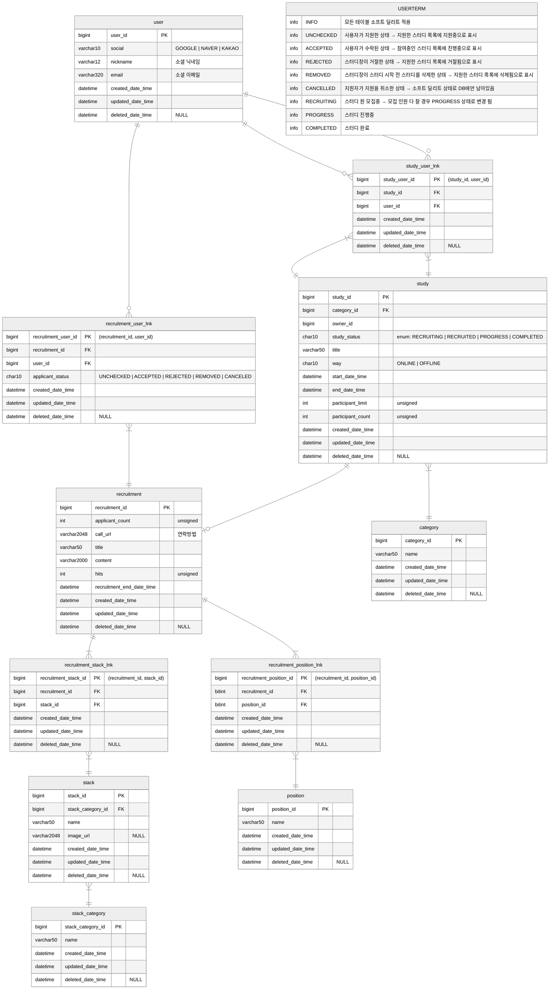

1. 테이블 명 단수 사용 News, Newss
2. int, integer 자료형 차이
3. updatedDateTime을 모든 테이블에 적용하는 이유여러 대의 Slave DB가 있을 때, DB
   를 합쳐야 하는 경우가 있을텐데, `updatedDateTime` 이 없으면 어떤 Slave DB의
   ROW가 최신 ROW인지 인지할 수 없어서각 DB의 로그를 다 뒤져서 업데이트 된 날짜
   를 찾아야 되는 수가 생길 수도 있음.
4. 네이밍 컨벤션

    - study_user_participants
    - study_user_applicants
    - study_participants
    - study_applicants

5. M:N을 풀기 위해 중간테이블이 들어갔을 때, 네이밍 전략 조사 및 컨벤션 합의 필
   요
6. 중간 테이블에는 lnk를 붙인다.

[현재] 회원 가입 -> 현재 가입한 소셜 아이디만 탈퇴 가능

[별개 기능이 추가 된다면] 회원 가입 -> 연동 -> 연동 끊기 -> 탈퇴(최초에 가입한
소셜 아이디가 메인 아이디로 연동 끊기 불가, 모든 연동 끊은 뒤 메인 아이디로 탈퇴
가능)

[별개 기능이 추가 된다면 ver2] 상황: 아이디1로 가입되어 있음, 아이디2로 가입하려
는 상황사용자1 (아이디1, 아이디2)

## 회원 탈퇴 페이지에서 현재 로그인한 하나의 계정만 탈퇴하도록 진행하는 이유

### 단점

1. **동일 사용자 특정에 제약이 있음**

- 이미 가입된 아이디1과 현재 가입하려는 아이디2가 동일한 사용자의 아이디인지 특
  정하기 어렵다. 이를 해결하기 위해선 사용자를 특정할 수 있는 정보가 필요하다.

- **case1. 이메일로 사용자를 특정하는 경우**

    - 모든 소셜 계정의 이메일이 같지 않을 수 있음. 사람의 행동 패턴마다 다름.
    - 특정 이메일로 가입된 사용자를 구분한다면, 사용자는 다른 이메일을 사용해서 가
      입한 계정이 있다는 사실을 인지하지 못하여 불완전.
    - 애플의 경우, hide my mail 기능을 사용해서 fake 메일을 사용하기 때문에 구현
      불가. 구현이 되더라도 해커가 특정 사용자의 가입된 계정을 한번에 볼 수 있어서
      오히려 부작용이 있을 가능성.

- **case2. 전화번호로 사용자를 특정하는 경우**
    - 전화 번호는 바뀔 수 있음.
    - 이전 사용자의 정보가 보이거나, 내가 전화 번호를 바꾸고 갱신하는 법을 잊어버
      린 경우 정보가 노출될 수 있음.

## 소셜 로그인을 통한 "연동"

구글 (최초 가입한 계정) - 루트 계정을 다른 소셜로 변경 불가 - 탈취 가능성 | 네이
버, 카카오(계정을 입력) - 서브 로그인용 -> 이미 가입된 계정이라 연동이 불가하다
탈퇴하고 연동하라는 가이드라인 제시<

다른 루트 계정에 연동이 되어 있는 소셜 아이디로 회원 가입 시, 이미 연동이 되어
있는 계정입니다. 연동 풀고 가입하라는 가이드라인 제시<

카카오로 회원가입하면카카오 (최초 가입한 계정) |

<!--
study_applicant
김준기 스터디A
김준기 스터디C
김준기 스터디D
김준기 스터디E
신창혁 스터디A
신창혁 스터디A
 -->
<!-- study ||--|{ study_category: "" -->

<!-- @Entity
class BaseEntity {
@CreatedDate
LocalDateTime createdDateTime
@LastModifiedDate
LocalDateTime updatedDateTime
}

    @Entity
    class User extends BaseEntity {
        @Id
        Long id;
        String name;
        int age;
    } -->

user{ id: 1 } user{ id: 2 }

user_study { user_id: 1, study_id: 10, }

user_study { user_id: 1, study_id: 11, }

study{ id: 10 } study{ id: 11 }

스터디: 스프링, 노드js, 도커 study_stack 1, 백엔드 1, 프론트엔드 1, 데브옵스

study_stack 1, 스프링 1, 노드js 1, docker

stack

Study { stacks: [ Stack: { category: Category } ],

}

Study {

categories: [ Category: { stacks: [ asdasd ], } ] ]

## 조회수

