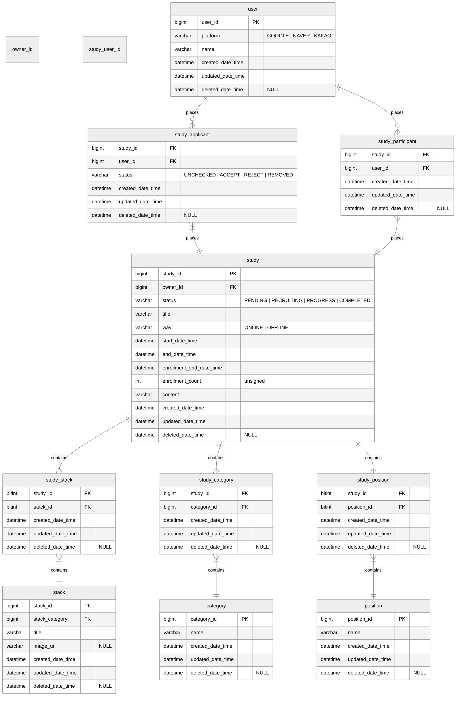

# ERD 설계

1. 테이블 명 단수 사용 News, Newss
2. int, integer 자료형 차이
3. updatedDateTime을 모든 테이블에 적용하는 이유
   여러 대의 Slave DB가 있을 때, DB를 합쳐야 하는 경우가 있을텐데,
   `updatedDateTime` 이 없으면 어떤 Slave DB의 ROW가 최신 ROW인지 인지할 수 없어서
   각 DB의 로그를 다 뒤져서 업데이트 된 날짜를 찾아야 되는 수가 생길 수도 있음.
4. 네이밍 컨벤션

    - study_user_participants
    - study_user_applicants
    - study_participants
    - study_applicants

5. M:N을 풀기 위해 중간테이블이 들어갔을 때, 네이밍 전략 조사 및 컨벤션 합의 필요

